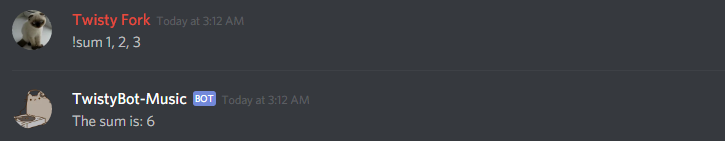
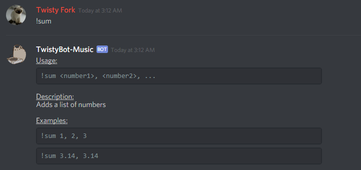

# Writing Commands

Commands can be added to TwistyBot in two ways. The first method uses [Client.add_command()](/docs/api.md#client-add-command) to directly add a single command. The following code demonstrates using Client.add_command() to add a command that adds together a list of numbers.

```javascript
let bot = new TwistyBot.Client();
await bot.add_command({
	// The name and category are required if using bot.add_command
	name: 'sum',
	category: 'General',

	// Used to generate help text
	help: {
		description: 'Adds a list of numbers',
		parameters: '<number1>, <number2>, ...',
		examples: [
			'1, 2, 3',
			'3.14, 3.14'
		]
	},

	// Specify that we need at least 2 parameters to continue
	params: {
		min: 2
	},

	// The function that does the work of the command
	run: async function(Discord, client, params, options) {
		let sum = 0;
		params.forEach(p => sum += parseFloat(p));
		return 'The sum is: ' + sum;
	}
});

```

The result of running the command:


The helptext generated from the help properties:


The second method of adding commands uses [Client.add_command_directory()](api.md#client-add-command-folder)